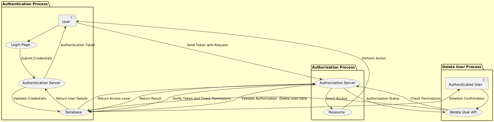

# User Deletion Functionality

This document provides a combined script that integrates backend and frontend logic for implementing a user deletion functionality in a web application. The functionality allows authenticated users to delete other users by their username.

## Backend Code

### `authController.js`

This file contains the logic for deleting a user based on their username.

```javascript
// controllers/authController.js

async function delete_user_by_username(req, res) {
    try {
        const { username } = req.body;
        const deletedUser = await UserModel.destroy({
            where: {
                username: username
            }
        });
        if (deletedUser) {
            res.status(200).json({ message: "User deleted successfully" });
        } else {
            res.status(404).json({ message: "User not found" });
        }
    } catch (error) {
        res.status(500).json({ message: "Error deleting user", error });
    }
}
```

### `authHandling.js`

This file handles the routing for the user deletion functionality, ensuring that only authenticated users can perform the deletion.

```javascript
// routes/authHandling.js

router.post(
    "/delete/user",
    authentication,
    authorisation({ isAdmin: false }),
    (req, res) => authController.delete_user_by_username(req, res)
);
```

## Frontend Code

### `userProfile.js`

This file (or a new file) contains the frontend logic for submitting the username of the user to be deleted. It listens for a form submission, sends the username to the backend, and handles the response.

```javascript
// js/userProfile.js (or create a new file if preferred)

document.getElementById("delete-user-form").addEventListener("submit", async (event) => {
    event.preventDefault();
    const username = document.getElementById("other-username").value;
    const response = await fetch(`http://localhost:4001/auth/delete/user`, {
        method: "POST",
        headers: {
            "Content-Type": "application/json"
        },
        body: JSON.stringify({ username })
    });

    const result = await response.json();
    if (response.ok) {
        alert(result.message);
    } else {
        alert(result.message || "Failed to delete user");
    }
});


## Step 2: Challenge Part 2

### Explanation of the Requirement

The requirement states: “This delete user functionality can be done after authentication.” Based on my understanding of authentication and authorization, this requirement has both advantages and disadvantages.

#### Is It a Good or Bad Idea?

**Advantages:**
- **Authentication Requirement:** Ensuring that a user is authenticated before allowing actions such as deleting another user is a fundamental security measure. It confirms that the user attempting the action is indeed a legitimate user of the system.
- **Simplified Access:** In a system where all authenticated users have equal privileges, allowing such actions after authentication may be appropriate.

**Disadvantages:**
- **Lack of Authorization Check:** The major concern here is the absence of an authorization check. Authentication verifies the identity of the user, but it does not verify whether the user is permitted to perform a specific action. Allowing deletion solely after authentication can lead to unauthorized actions, such as users deleting accounts they should not have access to.
- **Potential for Misuse:** If all authenticated users are allowed to delete accounts, it could result in abuse or accidental deletion of important accounts.

### Difference Between Authentication and Authorization

**Authentication** is the process of verifying the identity of a user, typically through credentials like a username and password.

**Authorization** is the process of determining what an authenticated user is allowed to do within the system, including permissions and access levels.

**Conclusion:** While authentication is essential for verifying a user's identity, authorization is crucial for ensuring that the user has the appropriate permissions to perform specific actions. Therefore, relying solely on authentication for actions like deleting users without incorporating proper authorization is not advisable.

### Diagram

Below is a visual representation of the relationship between authentication and authorization:



